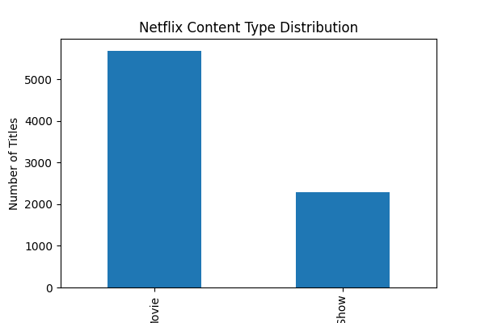
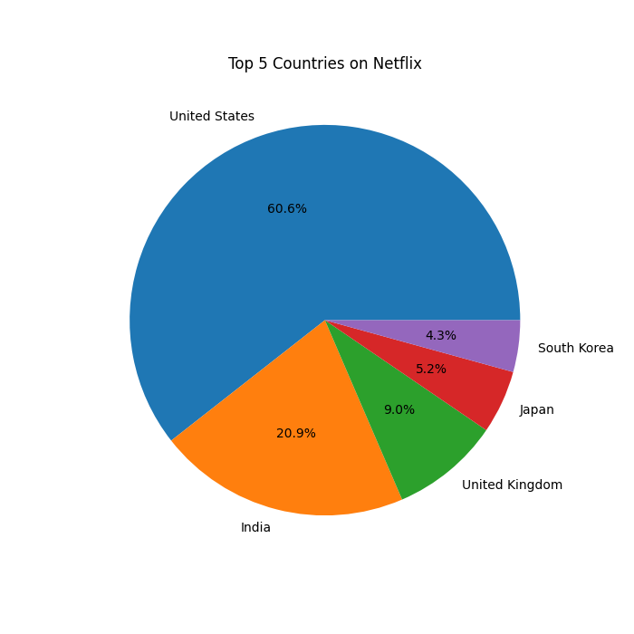

# 🎬 Netflix Data Analysis Project

## Overview
This project explores Netflix movies and TV shows using Python and data analysis techniques.  
The dataset was analyzed to understand content distribution, popular genres, ratings, and country-wise trends.

## Features
- Cleaned and analyzed Netflix dataset
- Compared Movies and TV Shows
- Identified top countries producing Netflix content
- Explored popular genres and ratings
- Created data visualizations using Matplotlib

## Technologies Used
- Python
- Pandas
- Matplotlib
- VS Code

## Key Insights
- Netflix contains more Movies than TV Shows
- United States has the highest amount of content
- International Movies are highly popular
- TV-MA is the most common rating category

## Visualizations

### Movies vs TV Shows

### Top 5 Countries

## Conclusion
This project helped in understanding real-world data analysis workflows including data cleaning, visualization, and extracting meaningful insights from datasets.
